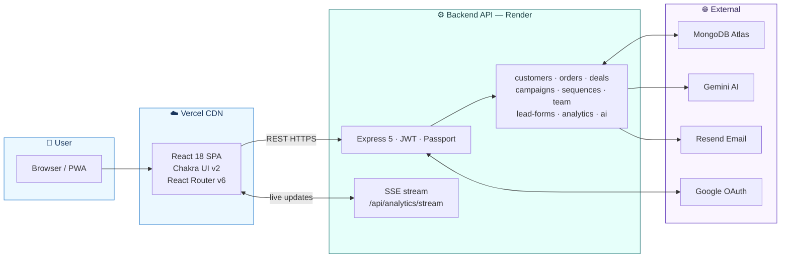

# Flayx CRM — Frontend

React 18 + TypeScript single-page application for Flayx CRM. Built with Create React App and Chakra UI v2.

**Live app:** https://smart-serve-crm-frontend.vercel.app  
**Backend API:** https://smartserve-crm-backend.onrender.com

---

## Tech Stack

| Layer | Technology |
|-------|-----------|
| Framework | React 18 + TypeScript (Create React App) |
| UI library | Chakra UI v2 |
| Routing | React Router v6 (all pages lazy-loaded) |
| HTTP | Axios |
| Charts | Recharts / Chart.js |
| Icons | React Icons (Feather set) |
| Build | CRA webpack (`CI=false npm run build`) |

---

## Project Structure

```
SmartServe-CRM-Frontend/
├── public/
│   └── index.html
├── src/
│   ├── App.tsx                    # Root — all routes wired, React.lazy loaded
│   ├── index.tsx
│   ├── pages/
│   │   ├── Login.tsx
│   │   ├── Register.tsx
│   │   ├── Dashboard.tsx          # KPI cards with SSE live data
│   │   ├── Customers.tsx
│   │   ├── Orders.tsx
│   │   ├── Campaigns.tsx
│   │   ├── Segments.tsx
│   │   ├── Pipeline.tsx           # Kanban deal board
│   │   ├── Revenue.tsx            # Revenue analytics
│   │   ├── Sequences.tsx          # Drip email sequences
│   │   ├── LeadForms.tsx          # Lead capture form builder
│   │   ├── PublicLeadForm.tsx     # Public-facing form page (no auth)
│   │   ├── TeamSettings.tsx       # Invite + manage team members
│   │   ├── AcceptInvite.tsx       # Invite acceptance / signup page
│   │   ├── Analytics.tsx
│   │   ├── AiAssistant.tsx        # Gemini-powered chat
│   │   ├── Profile.tsx
│   │   └── Settings.tsx
│   ├── components/                # Shared layout, Navbar, modals, etc.
│   ├── services/                  # Axios API modules per resource
│   ├── context/
│   │   └── AuthContext.tsx        # JWT storage, user state, login/logout
│   ├── types/                     # TypeScript interfaces
│   └── utils/                     # Helpers, formatters
├── vercel.json                    # SPA rewrites + CI=false build override
├── .env.production                # Gitignored — set in Vercel dashboard
└── package.json
```

---

## Architecture



---

## Pages & Routes

| Route | Page | Notes |
|-------|------|-------|
| `/login` | Login | Email/password + Google OAuth |
| `/register` | Register | |
| `/dashboard` | Dashboard | Live KPI cards via SSE |
| `/customers` | Customers | Full CRUD |
| `/orders` | Orders | |
| `/campaigns` | Campaigns | Segment builder, send, stats |
| `/segments` | Segments | AND/OR rule builder |
| `/pipeline` | Pipeline | Drag-and-drop Kanban |
| `/revenue` | Revenue | Revenue charts + forecasting |
| `/sequences` | Sequences | Drip email editor |
| `/lead-forms` | LeadForms | Form builder + embed code |
| `/form/:token` | PublicLeadForm | No-auth public submission page |
| `/team` | TeamSettings | Invite members, change roles, remove |
| `/accept-invite` | AcceptInvite | Reads `?token=` from URL |
| `/analytics` | Analytics | |
| `/ai-assistant` | AiAssistant | Gemini chat |
| `/profile` | Profile | |
| `/settings` | Settings | |

---

## Local Setup

### Prerequisites

- Node.js 18+
- Backend running locally or pointed at the production API

### 1. Install

```bash
git clone <repo-url>
cd SmartServe-CRM-Frontend
npm install
```

### 2. Create `.env.local`

```env
REACT_APP_API_URL=http://localhost:5000
REACT_APP_NAME=Flayx
REACT_APP_GOOGLE_CLIENT_ID=your-google-client-id
```

### 3. Run

```bash
npm start
```

App runs at `http://localhost:3000`.

> If you get `Module not found` errors after adding new pages, clear the webpack cache:
> ```powershell
> Remove-Item -Recurse -Force "node_modules\.cache"
> ```
> Then restart the dev server.

---

## Environment Variables

| Variable | Description |
|----------|-------------|
| `REACT_APP_API_URL` | Backend base URL (no trailing slash) |
| `REACT_APP_NAME` | App display name |
| `REACT_APP_GOOGLE_CLIENT_ID` | Google OAuth client ID |

All `.env*` files are in `.gitignore`. For production, set these in the Vercel dashboard under **Project → Settings → Environment Variables**.

---

## Deployment (Vercel)

The repo is connected to Vercel for automatic deploys on push to `main`.

**`vercel.json`** overrides the build command and adds SPA rewrites:

```json
{
  "buildCommand": "CI=false npm run build",
  "rewrites": [{ "source": "/(.*)", "destination": "/index.html" }]
}
```

`CI=false` is required because CRA treats all ESLint warnings as build errors in CI mode. Without it, the Vercel build will fail on warnings that are harmless in development.

---

## Auth Flow

1. User logs in via `/login` (email/password or Google OAuth)
2. Backend returns a JWT
3. `AuthContext` stores the token in `localStorage` and attaches it as `Authorization: Bearer <token>` on all Axios requests
4. On page load, `AuthContext` validates the stored token against `GET /api/auth/me`
5. Protected routes redirect to `/login` if no valid token is present

### Demo account

A demo account is available without registration:

- **Email:** demo@flayx.app
- **Access:** Click "Try Demo" on the login page, or `POST /api/auth/demo` to get a token programmatically

---

## Dashboard KPI Cards

The dashboard uses Server-Sent Events (`GET /api/analytics/stream`) for live data. KPI values use a compact number formatter:

| Raw value | Displayed as |
|-----------|-------------|
| 1,309,642 | $1.3M |
| 56,940 | $56.9k |
| 842 | $842 |

---

## License

MIT
